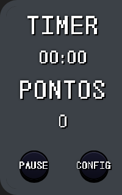
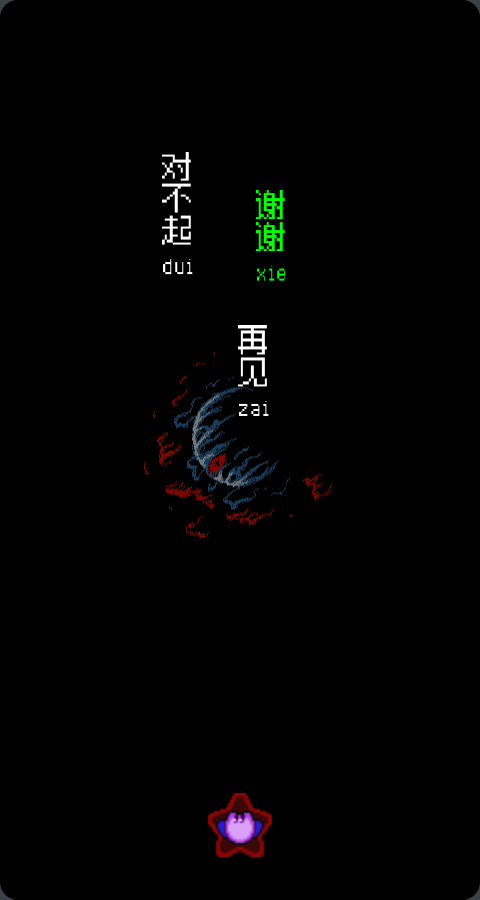
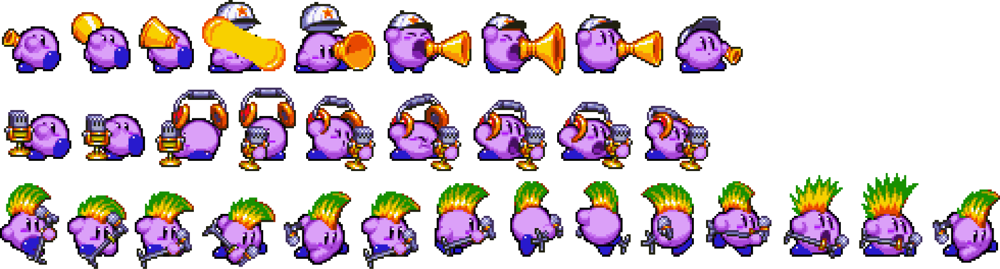

# hango-game
**Universidade Federal da Paraíba (UFPB)**  
**Curso de Licenciatura em Ciência da Computação**  
**TCC – 202X.X**

---
**HanGo-game** é um nome inicial para o projeto e poderá sofrer alterações. Trata-se de uma proposta de jogo digital voltado à aprendizagem de mandarim como **segunda língua**, com foco na associação entre os caracteres **hanzi** e o **pinyin**. O jogo será planejado como um material complementar, disponibilizado no formato de um site interativo, podendo ser utilizado como apoio ao ensino em cursos de idiomas.

### Escopo do projeto

O jogo terá como base o novo exame oficial de proficiência na língua chinesa mandarim para falantes não nativos, **HSK 3.0**, que amplia e reorganiza os requisitos de vocabulário para cada teste, sendo eles:
| Nível | HSK / Nº de palavras | Caracteres de reconhecimento cumulativo |
|---|:---:|:---:|
| Elementar | HSK 1 (300) HSK 2 (500) HSK 3 (1000) | 655 |
| Intermediário | HSK 4 (2.000) HSK 5 (3.600) HSK 6 (5.400) | 1.940 |
| Avançado | HSK 7–9	(11.000) | 3.088 |
> **Nota:** No nível avançado, o **HSK 7–9** é avaliado por meio de um único teste avançado, e o resultado divulgado identifica o nível alcançado.

Para adaptação em mecânicas gaimificadas, serão levadas em consideração a complexidade da escrita exigida em cada nível e a tabela oficial de palavras estabelecida pelo HSK 3.0.   
### Objetivos iniciais

Como entrega mínima viável do projeto, espera-se:

* Implementação do escopo do **HSK 1**, considerando o nível básico de escrita e a respectiva tabela de vocabulário;
* Implementação de um sistema de **estatísticas de desempenho do usuário**.

**Funcionalidades adicionais:**

* Ampliação das estatísticas internas de desempenho;
* Outras funcionalidades que possam ser incorporadas ao projeto durante o desenvolvimento.

### Tecnologias previstas

Para o desenvolvimento do projeto, estão previstas as tecnologias **HTML, CSS e JavaScript**, utilizadas na construção da interface e das funcionalidades do site. Para o desenvolvimento do back-end, ainda está em avaliação a utilização de **Python com Flask** ou **Java com Javalin**.

### Prototipo
O protótipo segue uma perspectiva vertical e apresenta uma interface sem efeitos visuais complexos, priorizando os testes iniciais das mecânicas e do desempenho. Seu objetivo é proporcionar uma representação inicial de como os elementos do cenário interagem entre si, além de permitir a avaliação do comportamento dos elementos durante a digitação, da velocidade, da fluidez da interação e de possíveis ideias complementares para o jogo. Alguns exemplos do protótipo são apresentados na tabela abaixo.

| Hub | Game play | Customisações |
|---|---|---|
|  |  |  |
> **Nota:** Para a visualização das mecânicas e a realização dos testes iniciais, foram utilizados personagens, sprites e cenários disponíveis na internet. Alguns desses recursos podem estar sujeitos a direitos autorais e foram utilizados exclusivamente na etapa de prototipação.

### Identidade visual
